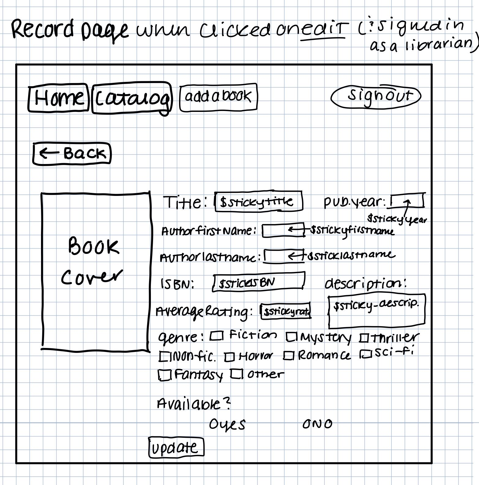

# Project 3: Design Journey

Be clear and concise in your writing. Bullets points are encouraged.

**Everything, including images, must be visible in Markdown Preview.** If it's not visible in Markdown Preview, then we won't grade it. We won't give you partial credit either. This is your warning.


## Design Plan

### Project 1 or 2
> Do you plan to reuse your Project 1 or 2 site?
> Which project?

I plan to reuse the idea of my project 2 but I plan to redesign it.

> If yes, please include sketches of the site's current design (you may copy the "final" sections from those assignments.)


### Describe your Media Catalog (Milestone 1)
> What will your collection be about?
> What type of media will your site display? (images, videos, audio)

My collection will be a small scale library. In terms of media it will display
images of each book's cover.


### Audiences (Milestone 1)
> Briefly explain your site's audiences. Be specific and justify why each audience is appropriate for your site.
> You are required to have **two** audiences: "information consumers" and "site administrators"

Information Consumer: This person would be somebody browsing the library for a book. They would
want to view the titles available and the information about the books (rating, author...). This website will not serve as a place where they can reserve the books
but instead display whether or not they are available at the library so the viewer
could go check them out in person if they desired.

Site Administrator: This would be the librarian. They would need to sign in and then have the ability to
add records to add new books they add to the library in order to keep the catalog up to date
with inventory.


### Personas (Milestone 1)
> Your personas must have a name and a "depiction". This can be a photo of a face or a drawing, etc.
> There is no required format for the persona.
> You may type out the persona below with bullet points or include an image of the persona. Just make sure it's easy to read the persona when previewing markdown.
> Your personas should focus on the goals, obstacles, and factors that influence behavior of each audience.

Picture of Personas:


> Persona for your "consumer" audience:

Rachel

Rachel is a 30 year old woman who likes to read in her free time. She has a full time
job as a Nurse Practitioner. Her favorite genre is sci-fi and doesn't have a
favorite author. She does most of her reading and browsing for new books on the
weekend and likes to read the highest rated, new books.


> Persona for your "administrator" audience:

Todd

Todd is a 23 year old librarian. He is in charge of managing the library catalog
and making sure it is up to date and reflective of what they have available. He is
an avid reader and doesn't have a genre preference. He likes to read all the new
releases when they add them to the catalog.


### Site Design (Milestone 1)
> Document your _entire_ design process. **We want to see iteration!**
> Show us the evolution of your design from your first idea (sketch) to the final design you plan to implement (sketch).
> Show us the process you used to organize content and plan the navigation, if applicable (card sorting).
> Plan your URLs for the site.
> Provide a brief explanation _underneath_ each design artifact. Explain what the artifact is, how it meets the goals of your personas (**refer to your personas by name**).
> Clearly label the final design.


This is my first design idea for my home page. I have a navigation bar in the upper
left hand corner and a sign in button in the upper right hand corner. I'm not
sure if I should be including the form page in the navigation bar or how to
handle that since it should only be available to librarians (i.e. Todd) who have successfully signed in. I will come back and complete my final sketch once we have learned
how signing in works.


This is my second home page design. After exploring lots of other catalog sites
similar to my goal I noticed most had a search bar right on the home page
so users can search the catalog right away. I think this is beneficial to
include and will create a very enjoyable usability experience for Rachel.
Once again, I will come back and complete my final sketch once we have learned
how signing in works because I suspect I will want to alter this slightly.


This is my final home page design. I have specified in the navigation bar that the
add a book form link will only show if the user is signed in and is a librarian.
I also decided to just include a sign in form in the upper right hand corner
instead of a button that links elsewhere. They will all be displayed in one line I just ran out of room on my sketch. This makes it easier and faster for Todd and Rachel to sign in; they don't have to navigate away from the current page.


This is my first design for my catalog page. I included the navigation bar
and the sign in button at the top. I put the search bar right underneath the
nav bar and the filtering options below that. My records table is to the right
and it will be displayed as tiles instead of a list like my project 2. Organizing
the content in this way will make the book cover images easier to see.


This is my second design for my catalog page. It is the same as the first just
with the addition of the sorting options. I think sorting is important to provide
Rachel with the best browsing experience. I will implement it as a drop down menu this time to save space and make sure this page doesn't feel too cluttered. As
is with the home page designs, I suspect I will want to make some slight alterations once we learn how signing in works so I will upload my final design
once we learn that.


This is my final design for my catalog page for when a user is not signed in. The add a book link is removed from the navigation bar, and the sign in form is shown in the upper right hand corner. I also rearranged the filtering options a little. Additionally I decided to position the records 3 across. The proportions look better on a desktop than they do in my sketches but with 3 across it's the perfect amount so the records aren't unnecessarily large.


This is my final design for my catalog page for when a user is signed in but not a librarian. The only change from the previous design is changing the sign in form in the upper right corner to a sign out button so Rachel can sign out when she's done browsing.


This is my initial design for my catalog page when the user is signed in as a librarian. I added an edit and a delete button to each record. As is with most of my designs, this one will highly likely change once I learn how signing in actually works and how to implement editing and deleting so I will upload the final design once we learn that.


This is my final design for my catalog page for when a user is signed in and is a librarian. The add a book navigation link is now visible to Todd, the edit buttons are visible on each record and the sign in form in the upper right changed to a sign out button.


This is my design for the record tile that will be displayed on the catalog page.
I created a separate sketch because I couldn't write small enough and have it
be legible on the catalog page design. Here, I want to highlight the book cover
image so it will take up the majority of the space. I will display whether or not
the book is available above the image and the author and genre below it. I want
to keep the actual record tile design rather simple. I will display the rest of the information that is stored about each book on the record specific page the user is brought to after clicking on the record.


This is my second design for my record tile. After experimenting with how it looks a
little, I decided listing just the title then the genres (tags) below it in
bubbles looks better and less cluttered. I will choose a certain color for
each tag since I have a set amount.


This is my final design for my record tile. Upon realizing that I include options to sort by rating and publication year I thought it was important to include those values on the record in addition to the title and the genre. I also included the source link for the cover image.


This is my initial design for my record page when the user clicks on a record.
I included more information about the book and will display the book cover to the
left. I included a back arrow which will go back to the catalog site. I think this
would be the right way to handle this but am not sure since we haven't really
talked about this yet. I am also still a bit unclear on the tags element but
when we learn about that I'll display them on the right under the publication year. As with the majority of my other designs I suspect I will want to make some slight alterations once we learn how signing in works so I will upload my final design once we learn that.


This is my final design for my record page when the user is not logged in and when the user clicks on a record. I changed the sign in button to be the sign in form in the upper right hand corner. I also rearranged the book's information a little bit. I decided to include a description field in my database which will be optional and have included it on here to display if there is text for the book being displayed.
If Rachel signs in this page will look exactly the same with the exception of a sign out button instead of the sign in form in the upper right hand corner. Additionally if Todd is signed in (a librarian) and he clicks on the record normally (i.e. DOESN'T CLICK ON THE EDIT BUTTON) then this page will also look the exact same just with the sign out button.


This is my initial attempt at the editing a record page for Todd. I added edit buttons next to each field that is in the record already. As is with most of my designs, this one will highly likely change once I learn how signing in actually works and how to implement editing a record so I will upload the final design once we learn that.


This is my second design for my record page when the user logged in as a librarian and when they have clicked on the edit button for this book from the catalog page. I changed the sign in button to be the sign out button in the upper right hand corner. I have mirrored the design for my regular record page so it feels comfortable for Todd.I will echo all the current values for the book in each input area. The genre check boxes will have the current genres selected and similarly for availability. I included the update button at the bottom so Todd can enter the new record when he has made changes.


This is my final design for my record page when the user logged in as a librarian and when they have clicked on the edit button for this book from the catalog page. The only change from my second design is the addition of a delete button in the upper right area so Todd could delete a book if he wanted to.


This is my final design for my edit confirmation page. This will show after Todd has updated a record from the edit record page (one directly above this). I will show a message saying the editing was successful and echo back the new record so he can review what he just changed.


This is my initial design for my form to enter a new book. I changed the sign in
button on the top to a sign out button because I think this page should only
be shown / be able to be accessed when Todd is signed in. The design is similar to my form design from project 2 however I will organize it into two columns and added
an upload spot for the cover art. As is with most of my designs, this one will highly likely change once I learn how signing in actually works and how to implement it so I will upload the final form design once we learn that.


This is my final design for my form to enter a new book. I have two forms on this page: the one on the left is to add a new book to the catalog and the one on the right is to add a new genre to the list of genres (tags). I wanted to keep both these forms on the same page since they are only applicable to the same audience (the librarian, Todd) and are related. I added the uploads section and the description to the adding a book form. I also changed the genres to checkboxes since books can have more than one genre associated with them.


This is my design for my page confirming the addition of a genre to the list of valid genres. I will display the confirmation message only in the right form on the page.


This is my form confirmation page design. I will echo back all the values that Todd entered back to him and display the cover art he uploaded. I don't anticipate this changing once we learn more but if it does I'll upload the new design.


This is my final form confirmation page design. I moved the cover art to display on the left side of the page instead of the right to stay consistent with my full record page and editing record page. I also added the enter another book button below echoing out all the newly entered values. The genres will display as a comma separated list of text.


This is my delete record confirmation page design. I'm not sure if a page like this is required but I thought it would make sense to have this so Todd can confirm he deleted the record successfully. I will echo back the title and author to Todd so he can confirm he deleted the correct record.


This is my 404 page design. I kept the description simple and non technical because neither of my audiences are assumed to have technical background. I instruct them to use the navigation bar to get back to the site pages.


### Design Patterns (Milestone 1)
> Write a one paragraph reflection explaining how you used the design patterns in your site's design.


I chose to follow the thumbnail catalog layout as we saw and discussed in lab. To make it seem familiar and comfortable for Rachel, I modeled much of my layout after many different Library sites which share common design elements. On the catalog page, I kept many of the base layout ideas from my project 2 because I think they work well for both Todd and Rachel. On the catalog page I included a sidebar with the filtering options which is a common aspect of list catalog site. The records will be displayed in a grid with the cover art being the main information shown on each card. Books are more often than not recognized by their cover art so displaying the cover larger helps Rachel browse the catalog more efficiently. I included the search bar above the records
to the left which is also common among sites like this and it makes it easy to find
quickly. Another change I made from my project 2 is including a search bar on the home page. After exploring many other library catalogs online I noticed this is a very common aspect included. It helps Rachel if she knows exactly what she wants and wants to find it quick. She can search right from the home page instead of having to navigate to the catalog page, then find the search bar there. I also converted the sorting options to a drop down because I felt they took up too much space in my project 2 design.


## Implementation Plan

### Requests (Milestone 1. Revise in Milestone 2)
> Identify and plan each request you will support in your design.
> List each request that you will need (e.g. view image details, view gallery, edit book, tag product, etc.)
> For each request, specify the request type (GET or POST), how you will initiate the request: (form or query string URL), and the HTTP parameters necessary for the request.


- Request: view book details
  - Type: GET
  - URL: /catalog/full-record?id=x
  - params: id (x)

- Request: add book to catalog
  - type: POST
  - URL: /form
  - params: title, first_name, last_name, isbn, genre(s), publication_year,
  average_rating, availability, cover art, cover art citation url, description (optional)

- Request: add genre to list of genres
  - type: POST
  - URL: /form
  - params: new_genre

- Request: edit book
  - type: POST
  - url: /catalog/full-record?id=x&edit=true
  - params: title, first_name, last_name, isbn, genre(s), publication_year,
  average_rating, availability, description (optional)

- Request: filtering the catalog
  - type: GET
  - url: /catalog?sort=&fiction=&mystery=&thriller=&non-fiction=&horror=&romance=&sci-fi=&fantasy=&other=&...any other genres the librarian entered &availability=&q=
  - params: fiction, mystery, thriller, non-fiction, horror, romance, sci-fi,
  fantasy, other, any other genres the librarian has entered, availability

- Request: searching the catalog
  - type: GET
  - url: /catalog?q=search_term&sort=&fiction=&mystery=&thriller=&non-fiction=&horror=&romance=&sci-fi=&fantasy=&other=&availability=
  - params: search_terms

- Request: sorting the catalog
  - type: GET
  - url: /catalog?q=&sort=sorting&fiction=&mystery=&thriller=&non-fiction=&horror=&romance=&sci-fi=&fantasy=&other=& ..any other genres the librarian entered &availability=
  - params: sorting


### Database Schema (Milestone 1. Revise in Milestone 2)
> Describe the structure of your database. You may use words or a picture. A bulleted list is probably the simplest way to do this. Make sure you include constraints for each field.

> Hint: You probably need a table for "entries", `tags`, `"entry"_tags` (stores relationship between entries and tags), and a `users` tables.

> Hint: For foreign keys, use the singular name of the table + _id. For example: `image_id` and `tag_id` for the `image_tags` (tags for each image) table.

Table: Books
- id: INT {PK,U,NN,AI}
- title: TEXT {NN}
- author_first_name: TEXT {NN}
- author_last_name: TEXT {NN}
- publication_year: INT {NN}
- average_rating: REAL {NN}
- isbn: INT {NN}
- available: INT {NN}
- description : TEXT {}

Table: Genres
- id: INT {PK,U,NN,AI}
- genre: TEXT {NN}

Table: books_and_genres
- id: INT {PK,AI,U,NN}
- book_id: INT {NN}
  (book_id is a foreign key referencing id in the books table)
- genre_id: INT {NN}
    (genre_id is a foreign key referencing id in the genres table)

Table: book_covers
- id: INT {PK,U,NN,AI}
- citation: TEXT {NN}
- file_ext: TEXT {NN}
- book_id: INT {NN} (book_id a foreign key that references the id in the books table)

From code given to us:

Table: users
- id: INT {PK,U,NN,AI}
- name: TEXT {NN}
- username: TEXT {NN, U}
- password: TEXT {NN}

Table: sessions
- id: INT {PK,U,NN,AI}
- user_id: INT {NN} (user_id is a foreign key referencing is in the users table)
- session: TEXT {NN,U}
- last_login: TEXT{NN}

Table: groups
- id: INT {PK,U,NN,AI}
- name: TEXT {NN, U}

Table: memberships
- id: INT {PK,U,NN,AI}
- group_id: INT {NN}
- user_id: INT {NN}


### Database Query Plan (Milestone 1. Revise in Milestone 2)
> Plan your database queries. You may use natural language, pseudocode, or SQL.

1. All records

    ```
 SELECT books.*, genres.genre, book_covers.citation, book_covers.extension FROM books LEFT OUTER JOIN books_and_genres ON books.id = books_and_genres.book_id LEFT OUTER JOIN genres ON books_and_genres.genre_id = genres.id LEFT OUTER JOIN book_covers ON books.id = book_covers.book_id;
    ```
A single record
    ```
    SELECT books.*, genres.genre, book_covers.citation, book_covers.extension FROM books LEFT OUTER JOIN books_and_genres ON books.id = books_and_genres.book_id LEFT OUTER JOIN genres ON books_and_genres.genre_id = genres.id LEFT OUTER JOIN book_covers ON books.id = book_covers.book_id WHERE books.id = bookid;
    ```

2. Insert record

    ```
    insert into books (author_first_name, author_last_name, title, publication_year, isbn, average_rating, available, description) values (first_name, last_name, title, pub_year, isbn, rating, available, description)

    INSERT INTO books_and_genres (book_id, genre_id) values (id, genre_id)

    insert into book_covers (book_id, citation, extension) values (book_id, citation, ext);

    ```

3. Inserting new genre
    ```
    insert into genres (genre) values (:genre);
    ```

 4. Editing a record
    ```
   UPDATE books SET author_first_name = :first_name, author_last_name = :last_name, title = :title, publication_year = :pub_year, isbn = :isbn, average_rating = :rating, available = :avail, description = :descrip WHERE (id = :id);

    DELETE FROM books_and_genres WHERE book_id = :id;

   INSERT INTO books_and_genres (book_id, genre_id) values (:id, (SELECT id from genres where genre = :genre));

    ```

5. Deleting a record

```
delete from books_and_genres where book_id = :book_id;

delete from books where id = :book_id;

```

6. Search records

    ```
    " SELECT books.*, genres.genre, book_covers.citation, book_covers.extension FROM books LEFT OUTER JOIN books_and_genres ON books.id = books_and_genres.book_id LEFT OUTER JOIN genres ON books_and_genres.genre_id = genres.id LEFT OUTER JOIN book_covers ON books.id = book_covers.book_id WHERE (title LIKE '%' || search term || '%') OR (author_first_name LIKE '%' || search term || '%') OR (author_last_name LIKE '%' || search term || '%') OR (ISBN LIKE '%' || search term || '%') OR (publication_year LIKE '%' || search term || '%') OR (average_rating LIKE '%' || search term || '%');";

    ```


Sorting by author last name (A-Z):
```
 SELECT books.*, genres.genre, book_covers.citation, book_covers.extension FROM books LEFT OUTER JOIN books_and_genres ON books.id = books_and_genres.book_id LEFT OUTER JOIN genres ON books_and_genres.genre_id = genres.id LEFT OUTER JOIN book_covers ON books.id = book_covers.book_id ORDER BY books.author_last_name ASC;
```

Sorting by author last name (Z-A):
```
 SELECT books.*, genres.genre, book_covers.citation, book_covers.extension FROM books LEFT OUTER JOIN books_and_genres ON books.id = books_and_genres.book_id LEFT OUTER JOIN genres ON books_and_genres.genre_id = genres.id LEFT OUTER JOIN book_covers ON books.id = book_covers.book_id ORDER BY books.author_last_name DES;
```
Sorting by average rating, ascending and descending
```
 SELECT books.*, genres.genre, book_covers.citation, book_covers.extension FROM books LEFT OUTER JOIN books_and_genres ON books.id = books_and_genres.book_id LEFT OUTER JOIN genres ON books_and_genres.genre_id = genres.id LEFT OUTER JOIN book_covers ON books.id = book_covers.book_id ORDER BY books.average_rating DESC;

 SELECT books.*, genres.genre, book_covers.citation, book_covers.extension FROM books LEFT OUTER JOIN books_and_genres ON books.id = books_and_genres.book_id LEFT OUTER JOIN genres ON books_and_genres.genre_id = genres.id LEFT OUTER JOIN book_covers ON books.id = book_covers.book_id ORDER BY books.average_rating ASC;
```

Sorting by publication year, oldest to newest and newest to oldest:

```
 SELECT books.*, genres.genre, book_covers.citation, book_covers.extension FROM books LEFT OUTER JOIN books_and_genres ON books.id = books_and_genres.book_id LEFT OUTER JOIN genres ON books_and_genres.genre_id = genres.id LEFT OUTER JOIN book_covers ON books.id = book_covers.book_id ORDER BY books.publication_year ASC;

 SELECT books.*, genres.genre, book_covers.citation, book_covers.extension FROM books LEFT OUTER JOIN books_and_genres ON books.id = books_and_genres.book_id LEFT OUTER JOIN genres ON books_and_genres.genre_id = genres.id LEFT OUTER JOIN book_covers ON books.id = book_covers.book_id ORDER BY books.publication_year DESC;
```

Filtering by genre:
```
 SELECT books.*, genres.genre, book_covers.citation, book_covers.extension FROM books LEFT OUTER JOIN books_and_genres ON books.id = books_and_genres.book_id LEFT OUTER JOIN genres ON books_and_genres.genre_id = genres.id LEFT OUTER JOIN book_covers ON books.id = book_covers.book_id WHERE genres.genre = "specified genre";
```


Filtering by available/not available titles:
```
 SELECT books.*, genres.genre, book_covers.citation, book_covers.extension FROM books LEFT OUTER JOIN books_and_genres ON books.id = books_and_genres.book_id LEFT OUTER JOIN genres ON books_and_genres.genre_id = genres.id LEFT OUTER JOIN book_covers ON books.id = book_covers.book_id WHERE books.availability = 1;

 SELECT books.*, genres.genre, book_covers.citation, book_covers.extension FROM books LEFT OUTER JOIN books_and_genres ON books.id = books_and_genres.book_id LEFT OUTER JOIN genres ON books_and_genres.genre_id = genres.id LEFT OUTER JOIN book_covers ON books.id = book_covers.book_id WHERE books.availability = 0;
```

### Code Planning (Milestone 1. Revise in Milestone 2)
> Plan any PHP code you'll need here using pseudocode.
> Use this space to plan out your form validation and assembling the SQL queries, etc.
> Tip: Break this up by pages. It makes it easier to plan.

home.php
```
Searching:

if the search has been submitted:

  navigate to the catalog page and preform search regularly:

    trim the search terms

    if the search terms are empty:
        set them to null
    else:
        set the sticky search

        set the sql query to my search query from above

        set the query parameters to the search term


```
catalog.php
```
init the database

set base sql query to retrieve all records

Searching:

if the search has been submitted:
    trim the search terms

    if the search terms are empty:
        set them to null
    else:
        set the sticky search

        set the sql query to my search query from above

        set the query parameters to the search term


Filtering:

set the genres array to all possible values

set the sql filter expressions to ''
set all the sql building conditionals to false
set the sql filter query to empty

get the value for availability from the get array

if its not empty or is 0 (0 is a possible value for availability):
    set the should filter and should filter availability to true

set the availability sticky values

for every genre in the genres array:
    convert it to lowercase

    if its checked:
        set the should filter value for this genre to true

    set sticky genres values

    if we should filter for this genre:

        check if the sql filter expression has an or already:

        add to the filter expression the sql for filtering for this genre (use
        the if statement to decide to include OR or not)

if we should filter in general:

    if we need to filter both availability and genres:
        construct sql query from the sql genre filter expressions we constructed in the
        for loop and add the
        availability statement
    if we need to just filter availability:
        build sql query for availability filtering
    if we need to just filter genre:
        build sql query from the genre filter expressions we constructed in the
        for loop

    set the general sql query to our final filter sql query


Sorting:

get the sorting value from the GET array

set all the sorting options css classes to empty
set the sorting sql query to '';

if the sorting value is not empty:

    check if its equal to each of the sorting options

    if it catches then set that css class to active and set the sort query accordingly

    have an else case in case of an untrusted value

    set the general sql query and concatenate it with the
    sort sql query we defined in the if else statements above


editing:

if the user has administrative abilities (i.e. is a librarian), show the edit,
 button on the catalog page:

  if the user clicks on edit: take them to the full record page in edit mode with sticky values for
  what is currently in there

    if they submit the update form:
    use sql to update the book
    show update confirmation page

    if they hit the delete button:
    use sql to delete the record
    show delete confirmation page


if the user doesnt have admin abilities: dont show the edit button on the
records.


within the html use php to execute the general sql query we have defined and display these records in the records table part

```

form.php
```

check if the user has admin abilities and if they do then show the page, if not
then hide everything and display according message


init the database

set all form conditional values

set all feedback classes to hidden

set all sticky values to empty

set the genre array to contain all possible values

if form has been submitted:

    trim all values from post array

    check to make sure each value was entered (every value is required)

    if the form is valid:
        set confirmation page to visible
        insert the book into the books table
        insert genre information into genres table if necessary
        insert stuff into books_and_genres table

    check to be sure it was inserted correctly


else:
    set all sticky values


if the add genre form has been submitted:

    trim value

    check if its already in the genres array

    if not then add it and show confirmation

    if it is then show feedback


within the html, include php to echo out the sticky values


On the confirmation page, echo out each value the librarian entered

```


## Submission

### Audience (Final Submission)
> Tell us how your final site meets the needs of the audiences. Be specific here. Tell us how you tailored your design, content, etc. to make your website usable for your personas. Refer to the personas by name.

My library catalog site fits both my audiences of an information consumer (Rachel) and an administrator (Todd).
I decided to implement 3 separate pages for the site to make it easier for each
audience to use. The home and catalog page are visible to anyone not signed in and to Rachel. The home, catalog and add a book page are visible only to Todd, a librarian when he is signed in. The home page serves to give Rachel an introduction to the site
and is a good first impression to the site so she isn't met with the catalog right
off the bat. She can also search right from the home page which is useful for when she knows exactly what she wants and needs the information quickly.

I've included the signing in form in my header so it appears across all my pages. This helps both my users in that they can sign in or out from any page. It makes the user experience better for them because they don't lose what they were looking at when they sign in or out.

On the catalog page I've included filtering by genre and availability,
multiple sorting options and a search bar. These all serve to aid Rachel in finding what
she wants most efficiently. I also made them remember so it makes more sense
for Rachel if she wanted to use filtering and sorting at the same time for example.

The form page is only visible to librarians, Todd. He will be managing the insertion
of new books to the library catalog which can be accomplished here. Additionally this page supports the capability to add new genres (my tags). For entering a new book I have a separate
field for each piece of information he would need to enter to make it clear what
to enter where. I made genre a list of checkboxes because he can select more than one genre per book (i.e. something can be both Sci-Fi and Mystery). This checkbox list updates if he chooses to add a new genre.
The form displays descriptive feedback if Todd doesn't enter a field. I've tailored the feedback to also check if isbn is a number, publication year is a valid year (not in
the future) and that rating is a float or int on a 1-5 scale and display the appropriate comment. Once Todd has
successfully entered in a book, a confirmation page is shown echoing each value back
to him so he can review what he just entered. It also displays the book cover image he uploaded back to him. I've also included a button on the confirmation
page that says enter another book. This button links back to the form page and provides
a more descriptive button to use when he is entering multiple books at once.


### Additional Design Justifications (Final Submission)
> If you feel like you haven’t fully explained your design choices in the final submission, or you want to explain some functions in your site (e.g., if you feel like you make a special design choice which might not meet the final requirement), you can use the additional design justifications to justify your design choices. Remember, this is place for you to justify your design choices which you haven’t covered in the design journey. You don’t need to fill out this section if you think all design choices have been well explained in the design journey.

I wanted to add here since it wasn't clear in my milestone 1, my genres are the tags for this project...A book can be assigned more than one genre (i.e. fiction and Horror), a librarian can add, or remove genres from books by editing the record. The librarian can also add new genres to the current list from the form on the add a book page. Rachel and Todd can see all entries for a genre at once (filtering by genre).

I also wanted to comment on the ISBN here and why I didn't choose to make it unique.
ISBN is an identifier for the specific edition of the book. It is NOT, however, a
unique identifier for each individual copy. Considering that a library might have
more than one copy of the same book it is possible for two books to have the same
ISBN value. This is why I didn't want to put the constraint on ISBN and want to
allow duplicate insertions of the same book edition as designated by the isbn value.


### Self-Reflection (Final Submission)
> Reflect on what you learned during this assignment. How have you improved from Project 1? What things did you have trouble with?

I think I've learned the most so far from this project. I learned how to implement signing in and out, how to use an init.sql file and enter in the seed data. I've also learned how to use joins to support the tagging element of this project which can extend to many other instances. I also learned how to handle file uploads and display media using html and sqlite. I've improved on my code efficiency and structure from project 1. My coding in php has gotten better and I feel more comfortable using the concepts we've learned and applying them in different scenarios.


### Grading: Mobile or Desktop (Final Submission)
> When we grade your final site, should we grade this with a mobile screen size or a desktop screen size?

desktop


### Grading: Step-by-Step Instructions (Final Submission)
> Write step-by-step instructions for the graders.
> The project if very hard to grade if we don't understand how your site works.
> For example, you must login before you can delete.
> For each set of instructions, assume the grader is starting from /

Viewing all entries:
1. Click on catalog page from navigation bar


View all entries for a tag:
1. Select a genre (or a few) from the filtering on the left side of the catalog page
2. Hit the filter button

View a single entry and all the tags for that entry:
1. click on the book's cover image from the catalog page


How to insert and upload a new entry:
1. sign in as todd (the librarian)

    username: todd

    password: monkey
2. click on the add a book page from the navigation bar

3. fill out the form on the left side of the page and hit submit

How to delete an entry:
1. sign in as todd (the librarian)

    username: todd

    password: monkey
2. navigate to the catalog page

3. click on the edit button of the record you want to delete (lower right hand corner of the tile)

4. Click on the delete button on the full record editing page (upper right corner under the banner)


How to view all tags at once:
1. All tags are displayed in the filtering side bar on the catalog page which is visible no matter if a user is signed in or not.
2. Another way to view all the current tags is in the add a book form (have to be a signed in librarian to see the form in the nav bar). They are listed in the genre section of the adding a book form.

How to add a tag to an existing entry:
1. sign in as todd (the librarian)

    username: todd

    password: monkey
2. navigate to the catalog page

3. click on the edit button of the record you want to add a tag to (lower right hand corner of the tile)

4. check the box of the corresponding genre you want to add to the book

5. hit the update button to submit the form

How to remove a tag from an existing entry:
1. sign in as todd (the librarian)

    username: todd

    password: monkey
2. navigate to the catalog page

3. click on the edit button of the record you want to remove a tag from (lower right hand corner of the tile)

4. uncheck the box of the corresponding genre you want to remove from the book

5. hit the update button to submit the form
